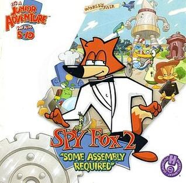

# Spy Fox 2: Some Assembly Required

HE 99

**Humongous Entertainment, 2015.** Spy Fox 2: "Some Assembly Required" is an
adventure game developed and published by Humongous Entertainment as part of
their Junior Adventure line and the second entry in the Spy Fox series of
games. The game follows the heroic Spy Fox as he races to stop a giant robot
from destroying the World's Fair. The game was released for computers in
September 1999.

## At a glance

|               |                                                                                    |
| ------------- | ---------------------------------------------------------------------------------- |
| **Developer** | Humongous Entertainment                                                            |
| **Publisher** | Humongous Entertainment                                                            |
| **Designer**  | Lisa Wick, Brad Carlton                                                            |
| **Artist**    | John Michaud (animator)                                                            |
| **Composer**  | Tom McGurk, Geoff Kirk                                                             |
| **Engine**    | SCUMM                                                                              |
| **Platforms** | Mac OS, Windows, iOS, Android                                                      |
| **Released**  | Windows, MacintoshWW, September 28, 1999LinuxWW, May 1, 2014iOSWW, August 13, 2015 |
| **Genre**     | Adventure                                                                          |
| **Modes**     | Single-player                                                                      |

## How it runs here

**Humongous titles are forks of SCUMM v6**, versioned separately as HE 60
through HE 100. v6 itself runs, draws and saves here; the HE extensions on top
of it are not separately verified, and the exact game-to-HE-number mapping in
`docs/released-games.md` is explicitly approximate. Worth trying, not relied
upon.

## Where it sits in this project

`docs/released-games.md` lists this title under **HE 99**. That page is the
scope statement for the whole catalogue and says, per Engine family and per
Version, what has actually been run rather than what is implemented —
**Completable** (`CONTEXT.md`) is claimed for no title on it.

## Elsewhere

- [Wikipedia: Spy Fox 2: "Some Assembly Required"](https://en.wikipedia.org/wiki/Spy_Fox_2:_%22Some_Assembly_Required%22)
- [`docs/released-games.md`](../../docs/released-games.md) — the full scope list
- [ScummVM](https://www.scummvm.org/) — the reference implementation this project checks itself against
