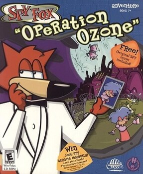

# Spy Fox 3: Operation Ozone

HE 100

**Humongous Entertainment, 2015.** Spy Fox: "Operation Ozone" is an adventure
game developed by Humongous Entertainment and published by Infogrames, part of
their "Junior Adventure" line and the final entry in the Spy Fox series of
games. The game follows the heroic Spy Fox as he prevents a villainess from
opening a massive hole in the ozone layer. The game was released for computers
in May 2001. In 2014, it was rereleased under the slightly modified title Spy
Fox 3: "Operation Ozone".

_This title has no article of its own. The text above is transcribed from **Spy
Fox: "Operation Ozone"**, which covers it, and the link under **Elsewhere**
goes there rather than to a page about this game alone._

## At a glance

|               |                                                                                       |
| ------------- | ------------------------------------------------------------------------------------- |
| **Developer** | Humongous Entertainment                                                               |
| **Publisher** | Infogrames                                                                            |
| **Designer**  | Brad Carlton                                                                          |
| **Producer**  | Rachel Frost                                                                          |
| **Writer**    | Brad Carlton                                                                          |
| **Composer**  | Tom McGurk, Geoff Kirk                                                                |
| **Series**    | Spy Fox                                                                               |
| **Engine**    | SCUMM                                                                                 |
| **Platforms** | Mac OS, Windows, Linux, iOS, Android                                                  |
| **Released**  | Windows, MacintoshWW, May 1, 2001LinuxWW, May 15, 2014iOS, AndroidWW, August 13, 2015 |
| **Genre**     | Adventure                                                                             |
| **Modes**     | Single-player                                                                         |

## How it runs here

**Humongous titles are forks of SCUMM v6**, versioned separately as HE 60
through HE 100. v6 itself runs, draws and saves here; the HE extensions on top
of it are not separately verified, and the exact game-to-HE-number mapping in
`docs/released-games.md` is explicitly approximate. Worth trying, not relied
upon.

## Where it sits in this project

`docs/released-games.md` lists this title under **HE 100**. That page is the
scope statement for the whole catalogue and says, per Engine family and per
Version, what has actually been run rather than what is implemented —
**Completable** (`CONTEXT.md`) is claimed for no title on it.

## Elsewhere

- [Wikipedia: Spy Fox: "Operation Ozone"](https://en.wikipedia.org/wiki/Spy_Fox:_%22Operation_Ozone%22)
- [`docs/released-games.md`](../../docs/released-games.md) — the full scope list
- [ScummVM](https://www.scummvm.org/) — the reference implementation this project checks itself against
