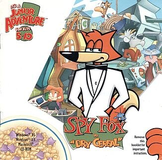

# Spy Fox in: Dry Cereal

HE 98

**Humongous Entertainment, 1997.** Spy Fox in "Dry Cereal" is an adventure game
developed and published by Humongous Entertainment as part of their Junior
Adventure line and the first entry in the Spy Fox series of games. It follows
the heroic Spy Fox as he attempts to stop a supervillain from stealing the
world's dairy milk supply.

The game was released for PC in October 1997 to positive reviews and was ported
to several other systems over the following decades.

## At a glance

|               |                                                                                                                                                                                                                           |
| ------------- | ------------------------------------------------------------------------------------------------------------------------------------------------------------------------------------------------------------------------- |
| **Developer** | Humongous Entertainment                                                                                                                                                                                                   |
| **Publisher** | Humongous Entertainment                                                                                                                                                                                                   |
| **Designer**  | Brad Carlton, Lisa Wick                                                                                                                                                                                                   |
| **Composer**  | Julian Soule, Geoff Kirk                                                                                                                                                                                                  |
| **Series**    | Spy Fox                                                                                                                                                                                                                   |
| **Engine**    | SCUMM                                                                                                                                                                                                                     |
| **Platforms** | Mac OS, Windows, Wii, iOS, Android, Linux, Nintendo Switch, PlayStation 4                                                                                                                                                 |
| **Released**  | title=October 17, 1997/Windows, MacintoshWW, October 17, 1997WiiNA, August 29, 2008iOSWW, May 4, 2012AndroidWW, April 1, 2014LinuxWW, April 17, 2014Nintendo SwitchWW, February 10, 2022PlayStation 4WW, November 3, 2022 |
| **Genre**     | Adventure                                                                                                                                                                                                                 |
| **Modes**     | Single-player                                                                                                                                                                                                             |

## How it runs here

**Humongous titles are forks of SCUMM v6**, versioned separately as HE 60
through HE 100. v6 itself runs, draws and saves here; the HE extensions on top
of it are not separately verified, and the exact game-to-HE-number mapping in
`docs/released-games.md` is explicitly approximate. Worth trying, not relied
upon.

## Where it sits in this project

`docs/released-games.md` lists this title under **HE 98**. That page is the
scope statement for the whole catalogue and says, per Engine family and per
Version, what has actually been run rather than what is implemented —
**Completable** (`CONTEXT.md`) is claimed for no title on it.

## Elsewhere

- [Wikipedia: Spy Fox in "Dry Cereal"](https://en.wikipedia.org/wiki/Spy_Fox_in_%22Dry_Cereal%22)
- [`docs/released-games.md`](../../docs/released-games.md) — the full scope list
- [ScummVM](https://www.scummvm.org/) — the reference implementation this project checks itself against
