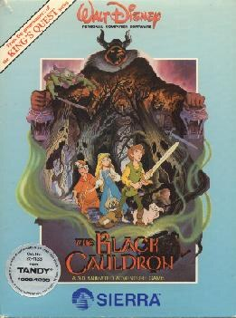

# The Black Cauldron

AGI v2

**Sierra On-Line, 1985.** The Black Cauldron is an adventure game designed by
Al Lowe of Sierra On-Line and published in 1985. The game is based on the
Disney film The Black Cauldron, which was itself based on the Chronicles of
Prydain novel of the same name by Lloyd Alexander. It was made shortly after
the first King's Quest game, so it resembles that game in many ways. Along with
The Dark Crystal it remained one of only a few adventure games by Sierra to be
based on films.

## At a glance

|                |                                                           |
| -------------- | --------------------------------------------------------- |
| **Developer**  | Sierra On-Line                                            |
| **Publisher**  | Sierra On-Line                                            |
| **Designer**   | Al Lowe, Roberta Williams                                 |
| **Producer**   | Joe Hale                                                  |
| **Programmer** | Scott Murphy, Ken Williams, Al Lowe, Sol Ackerman         |
| **Artist**     | Mark Crowe                                                |
| **Engine**     | Adventure Game Interpreter                                |
| **Platforms**  | Amiga, Apple II, Apple IIGS, Atari ST, MS-DOS, Tandy 1000 |
| **Released**   | October–December 1985                                     |
| **Genre**      | Adventure                                                 |
| **Modes**      | Single-player                                             |

## How it runs here

**AGI v2 is supported.** The resource layer, the vector Picture renderer with
both buffers and the priority bands, View cels, the Logic interpreter with all
183 action and 20 test commands, `WORDS.TOK` and the parser, `OBJECT` and
inventory, four-voice sound and saves all run.

**No AGI game has been played through here.** Everything above is tested
against the synthetic fixture in `tests/fixtureAgi.ts`, so this game is worth
trying rather than relied upon.

How the bytecode decodes depends on the build of Sierra's interpreter a copy
shipped against, not on the AGI major version. A copy carrying `AGIDATA.OVL` is
read rather than assumed; one that does not still plays, on a documented
default with the fallback logged, and is refused for editing (ADR 0013).

## Where it sits in this project

`docs/released-games.md` lists this title under **AGI v2**. That page is the
scope statement for the whole catalogue and says, per Engine family and per
Version, what has actually been run rather than what is implemented —
**Completable** (`CONTEXT.md`) is claimed for no title on it.

## Elsewhere

- [Wikipedia: The Black Cauldron (video game)](<https://en.wikipedia.org/wiki/The_Black_Cauldron_(video_game)>)
- [`docs/released-games.md`](../../docs/released-games.md) — the full scope list
- [ScummVM](https://www.scummvm.org/) — the reference implementation this project checks itself against
