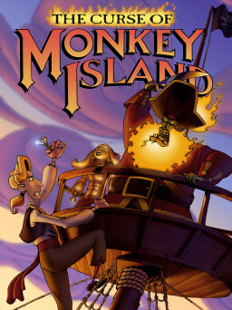

# The Curse of Monkey Island

SCUMM v8

**LucasArts, 1997.** The Curse of Monkey Island is a 1997 adventure game
developed and published by LucasArts for Microsoft Windows. A sequel to Monkey
Island 2: LeChuck's Revenge (1991), it is the third game in the Monkey Island
series. The story follows protagonist Guybrush Threepwood as he seeks to lift a
curse from his love Elaine Marley, while once again being menaced by undead
pirate LeChuck.

Production was led by a different creative team than the prior games, and took
new directions in graphics and gameplay. The art has a cartoon-like cel
animation style, and the previous games' verb command and inventory menus are
replaced by a pop-up action menu and inventory chest. The Curse of Monkey
Island was the twelfth and final LucasArts game to use the SCUMM engine, which
was extensively upgraded for the game. It was the first game in the series to
be released on CD-ROM, allowing for a full musical score, fully animated
cutscenes, and the introduction of voice acting for the characters. Dominic
Armato, Alexandra Boyd, Earl Boen, Leilani Jones, Neil Ross and Denny Delk
respectively voiced Guybrush, Elaine, LeChuck, The Voodoo Lady, Wally. B Feed
and Murray, and would reprise these roles in later installments.

The game sold well, particularly in Germany; lead background artist Bill Tiller
estimated that it sold half a million units worldwide over the next several
years. It was nominated for several gaming awards, and was named the best
adventure game of the year by several gaming publications. It was followed in
2000 by Escape from Monkey Island, which again took the series' graphics and
gameplay in new directions. The game was rereleased in 2018, alongside a
version for macOS.

## At a glance

|                |                                                                               |
| -------------- | ----------------------------------------------------------------------------- |
| **Developer**  | LucasArts                                                                     |
| **Publisher**  | LucasArts                                                                     |
| **Designer**   | Larry Ahern, Jonathan Ackley                                                  |
| **Director**   | Larry Ahern, Jonathan Ackley                                                  |
| **Programmer** | Jonathan Ackley, Aric Wilmunder                                               |
| **Artist**     | Larry Ahern, Bill Tiller                                                      |
| **Writer**     | Jonathan Ackley, Chuck Jordan, Chris Purvis, Larry Ahern                      |
| **Composer**   | Michael Land                                                                  |
| **Series**     | Monkey Island                                                                 |
| **Engine**     | SCUMM, iMUSE                                                                  |
| **Platforms**  | Windows, OS X                                                                 |
| **Released**   | Windows, NA, November 11, 1997, UK, November 14, 1997OS X, WW, March 22, 2018 |
| **Genre**      | Graphic adventure                                                             |
| **Modes**      | Single-player                                                                 |

## How it runs here

**SCUMM v8 runs, and no game has been played through on it.** The claim rests
on a synthetic fixture — see `docs/processes/verifying-version-support.md`.

## Where it sits in this project

`docs/released-games.md` lists this title under **SCUMM v8**. That page is the
scope statement for the whole catalogue and says, per Engine family and per
Version, what has actually been run rather than what is implemented —
**Completable** (`CONTEXT.md`) is claimed for no title on it.

## Elsewhere

- [Wikipedia: The Curse of Monkey Island](https://en.wikipedia.org/wiki/The_Curse_of_Monkey_Island)
- [`docs/released-games.md`](../../docs/released-games.md) — the full scope list
- [ScummVM](https://www.scummvm.org/) — the reference implementation this project checks itself against
