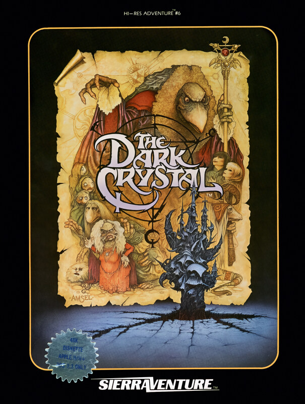

# The Dark Crystal

Hi-Res Adventure — pre-AGI

**Sierra On-Line, 1983.** Hi-Res Adventure #6: The Dark Crystal is a graphic
adventure game based on Jim Henson's 1982 fantasy film, The Dark Crystal. The
game was designed by Roberta Williams and was the first Hi-Res Adventure
directly released under the SierraVenture label in 1983. Versions were
published for the Apple II and Atari 8-bit computers. An alternative version of
the game intended for younger players called Gelfling Adventure was released in 1984.

## At a glance

|               |                       |
| ------------- | --------------------- |
| **Developer** | Sierra On-Line        |
| **Publisher** | SierraVenture         |
| **Designer**  | Roberta Williams      |
| **Artist**    | Jim Mahon             |
| **Series**    | Hi-Res Adventure      |
| **Engine**    | ADL                   |
| **Platforms** | Apple II, Atari 8-bit |
| **Released**  | 1983                  |
| **Genre**     | Adventure             |
| **Modes**     | Single-player         |

## How it runs here

**Not implemented, and not planned.** Hi-Res Adventure predates AGI: Sierra's
first adventures ran before there was a reusable interpreter worth naming, so
there is no Engine family here for them to belong to. Listed in
`docs/released-games.md` for the lineage, not as a target.

## Where it sits in this project

`docs/released-games.md` lists this title under **Hi-Res Adventure — pre-AGI**.
That page is the scope statement for the whole catalogue and says, per Engine
family and per Version, what has actually been run rather than what is
implemented — **Completable** (`CONTEXT.md`) is claimed for no title on it.

## Elsewhere

- [Wikipedia: The Dark Crystal (video game)](<https://en.wikipedia.org/wiki/The_Dark_Crystal_(video_game)>)
- [`docs/released-games.md`](../../docs/released-games.md) — the full scope list
- [ScummVM](https://www.scummvm.org/) — the reference implementation this project checks itself against
