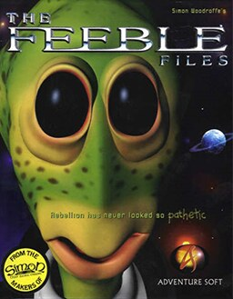

# The Feeble Files

AGOS Feeble

**Adventure Soft, 1997.** The Feeble Files is a 1997 adventure video game
developed and published by Adventure Soft for Microsoft Windows, and
republished by MacPlay for Macintosh in 2001 in Europe and 2002 in the United
States. The game is a comedic science fiction title in which players assume the
role of Feeble, an alien tasked with burning crop circles across the galaxy.
Adventure Soft began development of the game after seeking different subject
matter to their Simon the Sorcerer series of adventure games. The studio
pivoted to 3D computer graphics, creating animations using Silicon Graphics
hardware. Drawing from science fiction literature and television as
inspiration, the studio hired Red Dwarf actor Robert Llewelyn to provide voice
acting for the titular protagonist.

Upon release, The Feeble Files received a generally positive reception, with
reviewers praising the game's writing, sense of humor and performances, and
criticism directed at its puzzle design, difficulty and interface. Some
reviewers of the Mac version remarked that the game's visuals had dated poorly
by the time of release. The game was republished for GOG.com in December 2008.

## At a glance

|                |                                |
| -------------- | ------------------------------ |
| **Developer**  | Adventure Soft                 |
| **Publisher**  | Adventure Soft, MacPlay        |
| **Designer**   | Simon Woodroffe                |
| **Director**   | Michael Woodroffe              |
| **Producer**   | Michael Woodroffe              |
| **Programmer** | Alan Bridgman                  |
| **Writer**     | Simon Woodroffe                |
| **Composer**   | David R. Punshon, Graham Crabb |
| **Platforms**  | Windows, Mac, Amiga, WarpOS    |
| **Released**   | June 1997                      |
| **Genre**      | Adventure                      |
| **Modes**      | Single-player                  |

## How it runs here

**No AGOS game reaches a screen.** The readers do: `GAMEPC` end to end — the
item tree, the pooled strings and every Subroutine — the resource archive's
offset table, the Version probe, opcode and argument tables for all seven
Versions generated from ScummVM rather than transcribed, a disassembler,
byte-identical re-emission, saves, and an interpreter that runs the opcodes
common to every Version and reports the rest by name (ADRs 0027–0030).

**The renderer is what is missing.** Cel decoding exists as three tested
decoders and nothing composites them, so `render` paints an empty band layout
and the status line says why. Sound and the three interfaces are absent too.
None of it has been tested against a real game.

## Where it sits in this project

`docs/released-games.md` lists this title under **AGOS Feeble**. That page is
the scope statement for the whole catalogue and says, per Engine family and per
Version, what has actually been run rather than what is implemented —
**Completable** (`CONTEXT.md`) is claimed for no title on it.

## Elsewhere

- [Wikipedia: The Feeble Files](https://en.wikipedia.org/wiki/The_Feeble_Files)
- [`docs/released-games.md`](../../docs/released-games.md) — the full scope list
- [ScummVM](https://www.scummvm.org/) — the reference implementation this project checks itself against
