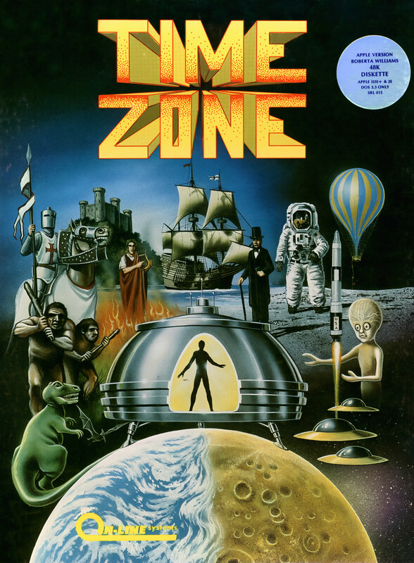

# Time Zone

Hi-Res Adventure — pre-AGI

**On-Line Systems, 1982.** Time Zone is a multi-disk graphical adventure game
written and directed by Roberta Williams for the Apple II. Developed in 1981
and released in 1982 by On-Line Systems (later Sierra Entertainment), the game
was shipped with six double-sided floppy disks and contained 1,500 areas
(screens) to explore along with 39 scenarios to solve. Produced at a time when
most games rarely took up more than one side of a floppy, Time Zone is one of
the first games of this magnitude released for home computer systems. Ports
were released for Japanese home computers PC-88, PC-98 and FM-7 in 1985.

## At a glance

|                |                                                 |
| -------------- | ----------------------------------------------- |
| **Developer**  | On-Line Systems                                 |
| **Publisher**  | On-Line Systems                                 |
| **Director**   | Roberta Williams                                |
| **Programmer** | Rorke Weigandt, Drew Harrington, Eric Griswold  |
| **Artist**     | Terry Pierce, Michelle Pritchard, Barry Blosser |
| **Writer**     | Roberta Williams                                |
| **Series**     | Hi-Res Adventure                                |
| **Engine**     | ADL                                             |
| **Platforms**  | Apple II, FM-7, PC-88, PC-98                    |
| **Released**   | February 1982 (Apple II), 1985 (ports)          |
| **Genre**      | Adventure                                       |
| **Modes**      | Single-player                                   |

## How it runs here

**Not implemented, and not planned.** Hi-Res Adventure predates AGI: Sierra's
first adventures ran before there was a reusable interpreter worth naming, so
there is no Engine family here for them to belong to. Listed in
`docs/released-games.md` for the lineage, not as a target.

## Where it sits in this project

`docs/released-games.md` lists this title under **Hi-Res Adventure — pre-AGI**.
That page is the scope statement for the whole catalogue and says, per Engine
family and per Version, what has actually been run rather than what is
implemented — **Completable** (`CONTEXT.md`) is claimed for no title on it.

## Elsewhere

- [Wikipedia: Time Zone (video game)](<https://en.wikipedia.org/wiki/Time_Zone_(video_game)>)
- [`docs/released-games.md`](../../docs/released-games.md) — the full scope list
- [ScummVM](https://www.scummvm.org/) — the reference implementation this project checks itself against
