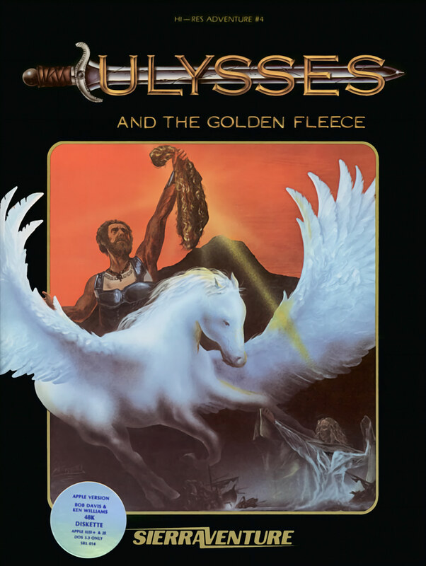

# Ulysses and the Golden Fleece

Hi-Res Adventure — pre-AGI

**Sierra On-Line, 1981.** Ulysses and the Golden Fleece is a graphic adventure
released by Sierra On-Line in 1981 for the Apple II. It was created by Bob
Davis and Ken Williams as part of the Hi-Res Adventure series. With a still
image displayed in the upper portion of the game screen, the player interacts
the via a two-word command parser. The game was ported to the Atari 8-bit
computers, Commodore 64, and IBM PC.

## At a glance

|               |                                             |
| ------------- | ------------------------------------------- |
| **Developer** | Sierra On-Line                              |
| **Publisher** | Sierra On-Line                              |
| **Designer**  | Bob Davis, Ken Williams                     |
| **Series**    | Hi-Res Adventure                            |
| **Engine**    | ADL                                         |
| **Platforms** | Apple II, Atari 8-bit, Commodore 64, IBM PC |
| **Released**  | 1981: Apple, 1982: Atari, IBM PC, 1984: C64 |
| **Genre**     | Adventure                                   |
| **Modes**     | Single-player                               |

## How it runs here

**Not implemented, and not planned.** Hi-Res Adventure predates AGI: Sierra's
first adventures ran before there was a reusable interpreter worth naming, so
there is no Engine family here for them to belong to. Listed in
`docs/released-games.md` for the lineage, not as a target.

## Where it sits in this project

`docs/released-games.md` lists this title under **Hi-Res Adventure — pre-AGI**.
That page is the scope statement for the whole catalogue and says, per Engine
family and per Version, what has actually been run rather than what is
implemented — **Completable** (`CONTEXT.md`) is claimed for no title on it.

## Elsewhere

- [Wikipedia: Ulysses and the Golden Fleece](https://en.wikipedia.org/wiki/Ulysses_and_the_Golden_Fleece)
- [`docs/released-games.md`](../../docs/released-games.md) — the full scope list
- [ScummVM](https://www.scummvm.org/) — the reference implementation this project checks itself against
