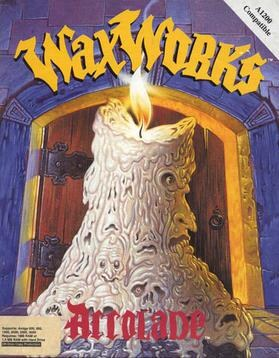

# Waxworks

AGOS Waxworks

**Horror Soft, 1992.** Waxworks is a 1992 role-playing video game developed by
Horror Soft and published by Accolade for Amiga, Classic Mac OS, and MS-DOS.
The player traverses historically themed dungeons, solving puzzles and fighting
enemies, to remove a curse from the player character's family. It was inspired
by the 1988 film Waxwork.

## At a glance

|               |                                                        |
| ------------- | ------------------------------------------------------ |
| **Developer** | Horror Soft                                            |
| **Publisher** | Accolade                                               |
| **Designer**  | Michael Woodroffe, Alan Bridgman, Simon Woodroffe      |
| **Artist**    | Maria Drummond, Paul Drummond, Kevin Preston, Jef Wall |
| **Writer**    | Richard Moran                                          |
| **Composer**  | Jezz Woodroffe                                         |
| **Platforms** | Amiga, MS-DOS, Mac                                     |
| **Released**  | November 1992                                          |
| **Genre**     | Role-playing                                           |
| **Modes**     | Single-player                                          |

## How it runs here

**No AGOS game reaches a screen.** The readers do: `GAMEPC` end to end — the
item tree, the pooled strings and every Subroutine — the resource archive's
offset table, the Version probe, opcode and argument tables for all seven
Versions generated from ScummVM rather than transcribed, a disassembler,
byte-identical re-emission, saves, and an interpreter that runs the opcodes
common to every Version and reports the rest by name (ADRs 0027–0030).

**The renderer is what is missing.** Cel decoding exists as three tested
decoders and nothing composites them, so `render` paints an empty band layout
and the status line says why. Sound and the three interfaces are absent too.
None of it has been tested against a real game.

## Where it sits in this project

`docs/released-games.md` lists this title under **AGOS Waxworks**. That page is
the scope statement for the whole catalogue and says, per Engine family and per
Version, what has actually been run rather than what is implemented —
**Completable** (`CONTEXT.md`) is claimed for no title on it.

## Elsewhere

- [Wikipedia: Waxworks (1992 video game)](<https://en.wikipedia.org/wiki/Waxworks_(1992_video_game)>)
- [`docs/released-games.md`](../../docs/released-games.md) — the full scope list
- [ScummVM](https://www.scummvm.org/) — the reference implementation this project checks itself against
