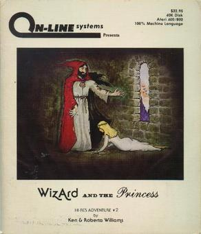

# Wizard and the Princess

Hi-Res Adventure — pre-AGI

**On-Line Systems, 1980.** Wizard and the Princess (also The Wizard and the
Princess, with a leading article) is a graphic adventure game written for the
Apple II and published in September 1980 by On-Line Systems. It is the second
installment in the Hi-Res Adventures series after Mystery House. Unlike its
predecessor, which featured monochrome drawings, Wizard and the Princess
introduced color graphics. Ports for the Atari 8-bit computers and Commodore 64
were released in 1982 and 1984 respectively. The 1982 self-booting disk version
for IBM PC compatibles was renamed Adventure in Serenia.

This game was one of the first graphical adventure games and served as a
precursor to Sierra On-Line's King's Quest series.

## At a glance

|                |                                                                                                                                                                                                                                                  |
| -------------- | ------------------------------------------------------------------------------------------------------------------------------------------------------------------------------------------------------------------------------------------------ |
| **Developer**  | On-Line Systems                                                                                                                                                                                                                                  |
| **Publisher**  | On-Line Systems                                                                                                                                                                                                                                  |
| **Designer**   | Roberta Williams                                                                                                                                                                                                                                 |
| **Programmer** | Ken Williams                                                                                                                                                                                                                                     |
| **Series**     | Hi-Res Adventures, King's Quest                                                                                                                                                                                                                  |
| **Engine**     | ADL                                                                                                                                                                                                                                              |
| **Platforms**  | Apple II, Atari 8-bit, IBM PC, PC-88, PC-98, FM-7, IBM PCjr, Commodore 64                                                                                                                                                                        |
| **Released**   | title = September 1980, / Apple II, / NA, September 1980, / Atari 8-bit, / NA, 1981, / IBM PC, / NA, 1982, / PC-88, PC-98, / JP, May 1983, / FM-7, / JP, June 1983, / IBM PCjr, / NA, March 1984, / Commodore 64, / NA, 1984, UK, September 1985 |
| **Genre**      | Adventure                                                                                                                                                                                                                                        |
| **Modes**      | Single-player                                                                                                                                                                                                                                    |

## How it runs here

**Not implemented, and not planned.** Hi-Res Adventure predates AGI: Sierra's
first adventures ran before there was a reusable interpreter worth naming, so
there is no Engine family here for them to belong to. Listed in
`docs/released-games.md` for the lineage, not as a target.

## Where it sits in this project

`docs/released-games.md` lists this title under **Hi-Res Adventure — pre-AGI**.
That page is the scope statement for the whole catalogue and says, per Engine
family and per Version, what has actually been run rather than what is
implemented — **Completable** (`CONTEXT.md`) is claimed for no title on it.

## Elsewhere

- [Wikipedia: Wizard and the Princess](https://en.wikipedia.org/wiki/Wizard_and_the_Princess)
- [`docs/released-games.md`](../../docs/released-games.md) — the full scope list
- [ScummVM](https://www.scummvm.org/) — the reference implementation this project checks itself against
