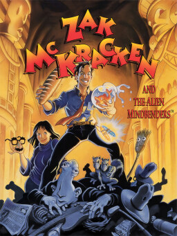

# Zak McKracken and the Alien Mindbenders

SCUMM v1–v3

**Lucasfilm Games, 1988.** Zak McKracken and the Alien Mindbenders is a graphic
adventure game by Lucasfilm Games released in 1988 for the Commodore 64 and
MS-DOS, then for the Amiga and Atari ST in 1989. It was the second game to use
the SCUMM engine, after Maniac Mansion. The project was led by David Fox, with
Matthew Alan Kane as the co-designer and co-programmer.

## At a glance

|               |                                                                                                            |
| ------------- | ---------------------------------------------------------------------------------------------------------- |
| **Developer** | Lucasfilm Games                                                                                            |
| **Publisher** | NA, Lucasfilm Games, EU, U.S. Gold                                                                         |
| **Designer**  | David Fox, Matthew Alan Kane, David Spangler                                                               |
| **Director**  | David Fox                                                                                                  |
| **Artist**    | Martin Cameron, Gary Winnick, Enhanced versions:, Mark Ferrari, Basilo Amaro                               |
| **Writer**    | David Fox, Matthew Alan Kane                                                                               |
| **Composer**  | Matthew Alan Kane, Chris Grigg (C64)                                                                       |
| **Engine**    | SCUMM                                                                                                      |
| **Platforms** | Commodore 64, MS-DOS, Amiga, Atari ST, FM Towns                                                            |
| **Released**  | title=October 1988/C64, MS-DOS, NA, 1988 Amiga, ST, NA, 1989 /Enhanced, MS-DOS, NA, 1989FM Towns, JP, 1990 |
| **Genre**     | [[Graphic adventure game                                                                                   |

## How it runs here

**Out of scope.** SCUMM v1 shipped as disk images and a cartridge ROM rather
than as files (`.out-of-scope/scumm-non-dos-releases.md`). Where a DOS
re-release exists it is the one that runs here.

## Where it sits in this project

`docs/released-games.md` lists this title under **SCUMM v1–v3**. That page is
the scope statement for the whole catalogue and says, per Engine family and per
Version, what has actually been run rather than what is implemented —
**Completable** (`CONTEXT.md`) is claimed for no title on it.

## Elsewhere

- [Wikipedia: Zak McKracken and the Alien Mindbenders](https://en.wikipedia.org/wiki/Zak_McKracken_and_the_Alien_Mindbenders)
- [`docs/released-games.md`](../../docs/released-games.md) — the full scope list
- [ScummVM](https://www.scummvm.org/) — the reference implementation this project checks itself against
